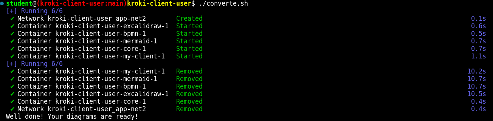

# kroki-client-user

## Objetivo

Este projeto pretende automatizar a conversão de [diagramas Mermaid](https://mermaid.js.org/syntax/mindmap.html) em imagens no formato svg.

## Utilidade

A automatização pode ser usada/integrada como um passo intermediário em processos de geração automática de documentos diversos, notadamente documentos de engenharia de software.

## Como Usar (Em 3 passos rápidos)

> REQUISITO: Você vai precisar do docker compose.

1. Faça download do [projeto](https://github.com/luizgsbraz/kroki-client-user/archive/refs/heads/main.zip);
2. Descompacte o arquivo `kroki-client-user-main.zip` e veja o que você tem:

```bash
cd $HOME/Downloads
unzip kroki-client-user-main.zip
ls -la  $HOME/Downloads/kroki-client-user-main
```

3. Execute os comandos abaixo:

```bash
cd $HOME/Downloads/kroki-client-user-main
. converte.sh; 
```

Serão criados vários containers para fazer o processamento. Aguarde pela Mensagem de Conclusão.



## Personalização

Para processar arquivos em outro diretório, abra o arquivo `converte.sh` e edite as linhas abaixo:

```markdown
# Edite para Personalizar
export IN_DIR=/MEU_PROJETO_DE_DOCUMENTACAO/diagramas_mermaid/in
export OUT_DIR=/var/tmp/kroki-client/MEU_PROJETO_DE_DOCUMENTACAO/out
export LOG_DIR=/var/tmp/kroki-client/MEU_PROJETO_DE_DOCUMENTACAO/log 
```
